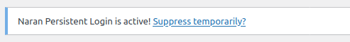
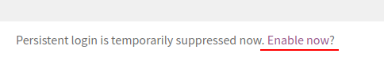

# Naran Persistent Login

개발시 유용한 워드프레스 항상 로그인 플러그인.

## wp-config.php 상수

다음 상수 목록을 `wp-config.php`에 선언할 수 있습니다.

| 상수 이름      | 필수   | 설명                                                                       |
|----------------|--------|------------------------------------------------------------------------|
| NPL_ENABLED    | 예     | 참이어야만 항상 로그인 가능.                                                  |
| NPL_USER       | 예     | 항상 유지될 유저 로그인(user_login).                                         |
| NPL_ADDR       | 아니오 | 'REMOTE_ADDR' 서버 변수를 체크하여 이 상수와 일치해야만 동작. 기본은 '127.0.0.1'     |
| NPL_REDIRECT   | 아니오 | 강제 로그인 처리시 리다이렉트 처리할 주소. 기본 '/wp-admin/'                       |
| NPL_NOTICE     | 아니오 | 플러그인이 동작할 때 관리자 알림 영역에 메시지를 출력하게 합니다. 'yes', 'no' 중 선택. 기본은 'yes'. |

## 임시 로그아웃
1.1.0 부터 임시 로그아웃 기능이 추가되었습니다.

관리자 알림 영역 메시지에 임시 로그아웃 링크를 클릭하면 됩니다.
즉, NPL_NOTICE가 'yes'여야만 기능을 사용할 수 있습니다.

다시 돌아오려면 프론트 영역 하단의 링크를 클릭하면 됩니다.

